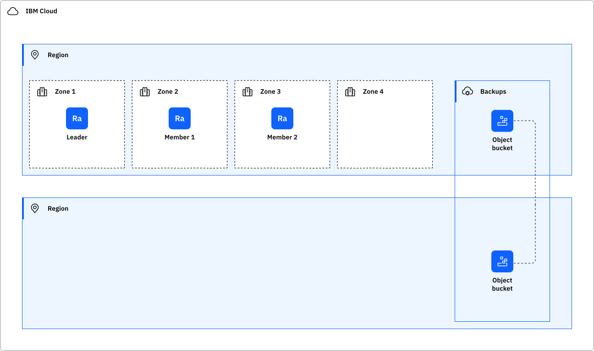
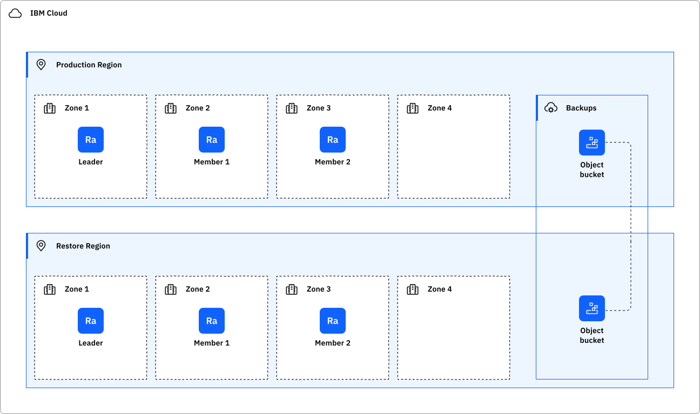

---

copyright:
  years: 2026,
lastupdated: "2026-06-11"

keywords: HA for rabbitmq, DR for rabbitmq, rabbitmq recovery time objective, rabbitmq recovery point objective

subcollection: messages-for-rabbitmq-gen2

---

{{site.data.keyword.attribute-definition-list}}

# Understanding high availability and disaster recovery for {{site.data.keyword.messages-for-rabbitmq}}
{: #rabbitmq-ha-dr}

[Gen 2]{: tag-purple}

[High availability](#x2284708){: term} (HA) is the ability for a service to remain operational and accessible in the presence of unexpected failures. [Disaster recovery](#x2113280){: term} is the process of recovering the service instance to a working state.
{: shortdesc}

{{site.data.keyword.messages-for-rabbitmq}} is a highly available regional service designed for availability during a regional outage. {{site.data.keyword.messages-for-rabbitmq}} is designed to meet the [Service Level Objectives (SLO)](/docs/resiliency?topic=resiliency-slo) with the Standard plan.

For more information about the available region and data center locations, see [Service and infrastructure availability by location](/docs/overview?topic=overview-services_region).

## High availability architecture
{: #ha-architecture}

{: caption="RabbitMQ architecture" caption-side="bottom"}

### High availability features
{: #ha-features}

{{site.data.keyword.messages-for-rabbitmq}} supports the following high availability features:

| Feature | Description | Consideration |
| -------------- | -------------- | -------------- |
| Automatic failover | Standard on all clusters and resilient against a zone or single member failure. |  |
| Member count | 3 member deployment. It is resilient to the failure of one member during the same failure period. | |
| Queue selection | Quorum Queues (default on Gen 2) ensure message durability and fast fail-over. Classic Queues are available but high availability is not supported on Gen 2. Using Classic Queues is not recommended and is not supported within the service terms and SLA. | Use Quorum Queues for production workloads. |
{: caption="HA features for {{site.data.keyword.messages-for-rabbitmq}}" caption-side="bottom"}

## Disaster recovery architecture
{: #disaster-recovery-intro}

The general strategy for disaster recovery is to create a new {{site.data.keyword.messages-for-rabbitmq}} instance using the backup, and restore it to the same or another region.

{: caption="RabbitMQ disaster recovery architecture" caption-side="bottom"}

### Disaster recovery features
{: #dr-features}

{{site.data.keyword.messages-for-rabbitmq}} supports the following disaster recovery features:

| Feature | Description | Consideration |
| -------------- | -------------- | -------------- |
| Backup restore | Create a new instance from previously created backup; see [Managing Cloud Databases backups](https://cloud.ibm.com/docs/messages-for-rabbitmq-gen2?topic=messages-for-rabbitmq-gen2-dashboard-backups&interface=ui#restore-backup). | New connection strings for the restored instance must be referenced throughout the workload. On Gen 2, backups include both configuration data and message data (an improvement over Gen 1 which backed up configuration only). Gen 2 uses independent backups that persist even after the source instance is deleted, enabling long-term data retention and cross-region disaster recovery. |
| Shovel | Asynchronous message routing that enables you to define replication between brokers across clusters. | Configure it within the same region or cross-region. |
{: caption="DR features for {{site.data.keyword.messages-for-rabbitmq}}" caption-side="bottom"}

### Planning for DR
{: #features-for-disaster-recovery}

The DR steps must be practiced regularly. As you build your plan, consider the following failure scenarios and resolutions.

| Failure | Resolution |
| -------------- | -------------- |
| Hardware failure (single point) | (Example) {{site.data.keyword.IBM_notm}} provides a database that is resilient from single point of hardware failure within a zone. No customer configuration is required. |
| Zone failure | The {{site.data.keyword.messages-for-rabbitmq}} members are distributed between zones. Three members provide additional resiliency to multiple zone failures. |
| Data corruption | Selection of durable queue type ensures that messages are intact. |
| Regional failure | Backup restore. Use the restored instance in production. `/n  /n` Shovel. Replicate messages cross region. |
{: caption="DR scenarios for {{site.data.keyword.messages-for-rabbitmq}}" caption-side="bottom"}

### Connection limits
{: #connection-limits}

It is important to prevent overwhelming your deployment with connections. If the number of connections to the database exceeds the connection limit, new connections fail and return an error. For more information {{site.data.keyword.messages-for-rabbitmq}}, see [Connection limits](/docs/messages-for-rabbitmq-gen2?topic=messages-for-rabbitmq-gen2-rabbitmq-ha-dr#connection-limits).

## Your responsibilities for HA and DR
{: #feature-responsibilities}

It is your responsibility to continuously test your plan for HA and DR.

Interruptions in network connectivity and short periods of unavailability of a service might occur. It is your responsibility to make sure that application source code includes [client availability retry logic](/docs/resiliency?topic=resiliency-high-availability-design#client-retry-logic-for-ha) to maintain high availability of the application.
{: note}

The following information can help you create and continuously practice your plan for HA and DR.

When restoring from backups, a new instance is created with new connection strings. Existing workloads and processes must be adjusted to consume the new connection strings.

A recovered database may also need the same customer-created dependencies of the disaster database - make sure this and other services exist in the recovered region:

   - {{site.data.keyword.keymanagementserviceshort}}

On Gen 2, independent backups persist even after the source instance is deleted, providing protection against accidental deletion. Independent backups follow a 30-day default retention period and can be manually deleted if no longer needed. For more information, see the [Backups FAQ](/docs/cloud-databases?topic=cloud-databases-faq-backups).

It is not possible to copy backups off the IBM Cloud, so consider using the service-specific tools for additional backups. Independent backups can be copied to different regions for enhanced disaster recovery. Careful management of IAM access to databases can help reduce exposure to malicious deletion.

The following checklist associated with each feature can help you create and practice your plan.

- Backup restore
   - Verify that backups are available at the desired frequency to meet RPO requirements. Manage Cloud Databases backups documents backup frequency. Gen 2 provides automatic daily backups as independent backup instances. Consider creating additional on-demand independent backups before major changes or migrations to improve RPO if the criticality and size of the database allow.
   - Independent backups can be copied to different regions for cross-region disaster recovery. Verify your restore goals can be achieved by reading managing Cloud Databases backups.
   - Verify the retention period of the backups meet your requirements. Independent backups follow a 30-day default retention period.
   - Schedule test restores regularly to verify that the actual restored times meet the defined RTO. Remember that database size significantly impacts restore time. Consider strategies to minimize restore times, such as breaking down large databases into smaller, more manageable units and purging unused data.
   - Independent backups persist even after the source instance is deleted, providing additional protection against accidental deletion.
   - Verify the Key Protect service for backup encryption.

To find out more about responsibility ownership between the customer and IBM Cloud for using {{site.data.keyword.messages-for-rabbitmq}}, see [Shared responsibilities for Cloud Databases](/docs/cloud-databases?topic=cloud-databases-responsibilities-cloud-databases).
